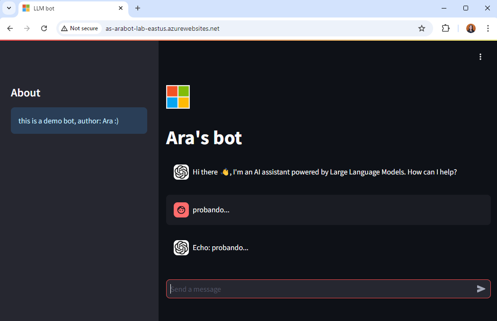

# Arabot

---





## Pre-requisites

1. Azure CLI [here](https://learn.microsoft.com/en-us/cli/azure/install-azure-cli)


## Folder structure

```bash
.
├── infra
├── Dockerfile
├── README.md
├── environment.yml
└── streamlit_app
    ├── config.yaml
    ├── images
    ├── llm_bot.py
    ├── main.py
    └── requirements.txt
```